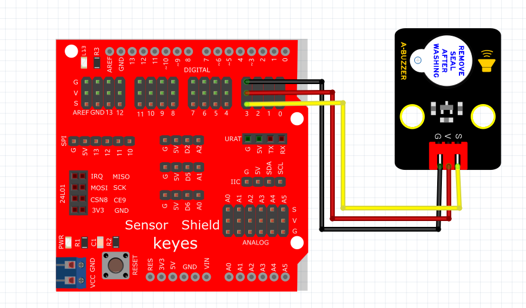

# Mixly

## 1. Mixly简介  

Mixly是一款旨在帮助初学者和儿童学习编程的图形化编程软件。它通过直观的模块化界面，使用户可以通过拖拽的方式轻松创建程序，而无需深入了解编程的复杂语法。Mixly特别适合与Arduino等硬件平台结合使用，用户可以利用该工具制作各种有趣的项目，包括互动装置和智能家居。  

Mixly的主要特点包括：  
- **图形编程**：用户可以通过可视化的方式编程，降低了学习门槛。  
- **模块丰富**：提供多种模块，支持不同功能的实现，如LED控制、传感器读取等。  
- **简单易用**：界面友好，使初学者能快速上手并理解编程逻辑。  
- **社区支持**：活跃的用户社区提供丰富的资源和项目分享，便于学习和交流。  

## 2. 连接图  

  

## 3. 测试代码  

1. 在输入/输出栏拖出数字输出模块，设置管脚为3，高电平。  

     

2. 在控制栏拖出延时模块，设置延时2000ms。  

     

3. 在输入/输出栏拖出数字输出模块，设置管脚为3，低电平。  

     

4. 在控制栏拖出延时模块，设置延时2000ms。  

     

## 4. 测试结果  

有源蜂鸣器只需要高电平电压便能发声。将代码烧录到控制器，并连接好电路后，上电后有源蜂鸣器响2秒，静音2秒，循环交替。

