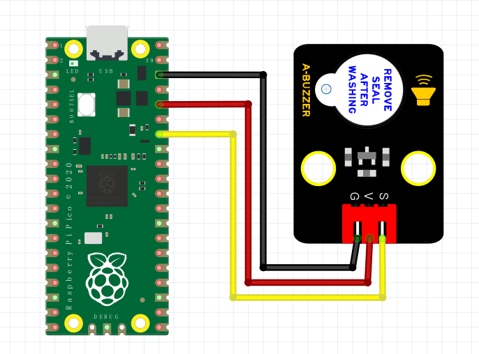

# Python

## 1. Python简介  

Python是一种高级编程语言，以其简洁、易读的语法和强大的功能而受到欢迎。它由荷兰程序员Guido van Rossum于1991年首次发布，并迅速成为编程教育和专业开发的热门选择。Python支持多种编程范式，包括面向对象、命令式和函数式编程。  

Python的主要特点包括：  
- **易于学习和使用**：Python的语法简单明了，适合初学者。  
- **广泛应用**：Python在数据分析、人工智能、自动化、网站开发等领域得到了广泛应用。  
- **强大的库和框架**：丰富的第三方库和框架，例如NumPy、Pandas、Django和Flask，增强了Python的功能和效率。  
- **社区支持**：活跃的开发者社区提供了海量的资源、教程和工具，方便学习和开发。  

## 2. 连接图  

  

## 3. 测试代码  

```python  
import machine  
import utime  

buzz = machine.Pin(28, machine.Pin.OUT)  # 设置28脚为蜂鸣器输出脚  

while True:  
    buzz.value(1)  # 设置28脚为高电平，蜂鸣器响  
    utime.sleep(2)  # 设置延时2秒  
    buzz.value(0)  # 设置28脚为低电平，蜂鸣器关  
    utime.sleep(2)  # 设置延时2秒  
```  

## 4. 测试结果  

有源蜂鸣器只需要高电平电压便能发声。在烧录好代码并连接好电路后，上电后，有源蜂鸣器响起2秒，随后静音2秒，循环交替。


